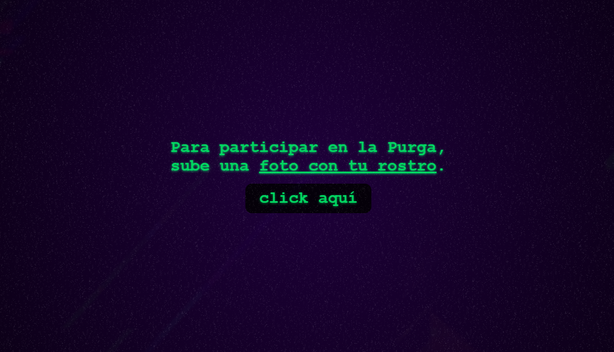

# La Purga de Halloween

La Purga de Halloween es una aplicación web creada como propuesta para participar en el "[Cloudinary CloudCreate: Spooky AI Hackathon](https://cloudinary.com/blog/cloudinary-cloudcreate-spooky-ai-hackathon)", organizado por [Cloudinary](https://cloudinary.com) junto a [Midudev](https://github.com/midudev).

## Demo

Puedes ver una demo de la aplicación subida a Vercel en [https://lapurga.vercel.app/](https://lapurga.vercel.app/).

## Captura



## Tecnologías utilizadas

- Astro [https://astro.build/](https://astro.build/)
- Cloudinary [https://cloudinary.com/](https://cloudinary.com/)
- Vanilla JavaScript
- HTML
- CSS

## Para iniciar

Clona el repositorio:

```sh
git clone https://github.com/pablocazorla/lapurga.git
```

Instala dependencias:

```sh
npm install
```

Corre el repositorio localmente:

```sh
npm run dev
```

Abre un navegador y ve a [http://localhost:4321/](http://localhost:4321/).

## Variables de entorno

Para correr el proyecto, debes crear un archivo `.env` en la raíz del proyecto con las siguientes variables de entorno:

- PUBLIC_CLOUDINARY_CLOUD_NAME
- PUBLIC_CLOUDINARY_API_KEY
- CLOUDINARY_API_SECRET

Puedes mirar el archivo `.env.example` como ejemplo.

Tales variables se pueden obtener en la sección "API Keys" de tu cuenta de Cloudinary.

## Crédito de la música utilizada

La música de piano de fondo utilizada en la aplicación tiene el siguiente crédito:

Blue Feather - Reunited de Kevin MacLeod cuenta con una licencia Creative Commons Atribución 4.0. https://creativecommons.org/licenses/by/4.0/

Fuente: http://incompetech.com/music/royalty-free/index.html?isrc=USUAN1200068

Artista: http://incompetech.com/

## Licencia

Licencia Creative Commons Atribución 4.0. https://creativecommons.org/licenses/by/4.0/

## Contacto

Por cualquier duda o sugerencia, no dudes en escribirme a mi correo: [pablo.david.cazorla@gmail.com](mailto:pablo.david.cazorla@gmail.com).
